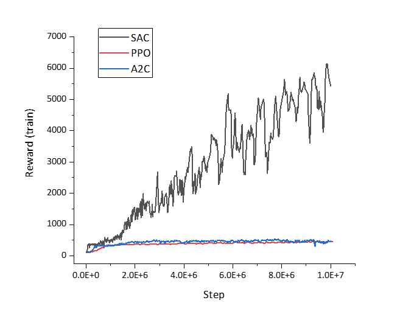
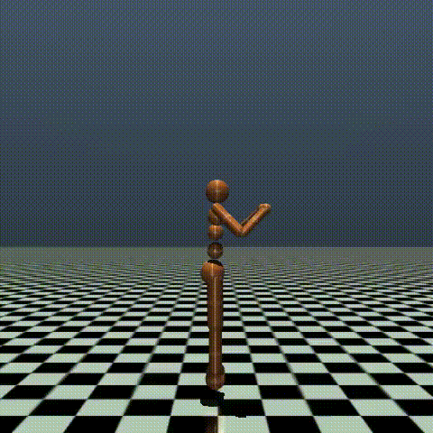
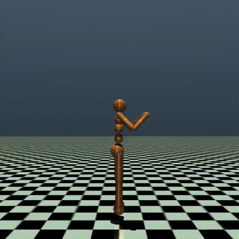

# Humanoid Reinforcement Learning Experiment

This is a small experiment using reinforcement learning to make a humanoid model walk, aiming to gain some experience and intuition.

## Introduction and methods

This reinforcement learning experiment primarily uses [Humanoid-V3](https://gymnasium.farama.org/environments/mujoco/humanoid/) from OpenAI's Gym and [Stable Baselines3](https://github.com/DLR-RM/stable-baselines3) (sb3). The objective of the environment is to move forward quickly without falling. According to the sb3 documentation, the default parameters of its reinforcement learning algorithms are somewhat empirical and can be used directly in some cases. Therefore, I was curious if this applies to robot control as well. Here, I compared three algorithms: PPO, SAC, and A2C.

While using these algorithms, I only specified the necessary parameters, and the action policy was consistently `MlpPolicy`. During training, I used 2 V100 GPUs and conducted 10M steps for each algorithm. The training took about 4 hours.

## Results
Here is the graph showing the relationship between reward and training steps:



### Evaluations of the Three Algorithms
- **PPO**
  - **Mean reward**: 442 ± 72  
    

- **A2C**
  - **Mean reward**: 338 ± 18  
    

- **SAC**
  - **Mean reward**: 6455 ± 82  
    

## Discussion

First of all, it must be emphasized that this is just a simple experiment with default hyper-parameters. This doesn't mean SAC outperformed other algorithms, so the following discussion is just some intuition:

Let's review the key differences between these three algorithms:
- **PPO**: Utilizes clipping to restrict overly rapid changes in action policies, ensuring stability in learning.
- **A2C**: Uses statistical methods to reduce the variance of Q-values without changing the expectation by subtracting a baseline with zero expectation.
- **SAC**: Adds an entropy term to the action policy to encourage more exploration.

From this, we can see that A2C and PPO emphasize learning stability, while SAC emphasizes exploration. In other words, the humanoid posture control task involves a more complex dimensional space compared to many other tasks suitable for default parameters. Therefore, humanoid posture control requires relatively more emphasis on exploration in learning. This is understandable since both the action space and observation space are relatively large in [Humanoid-V3](https://gymnasium.farama.org/environments/mujoco/humanoid/).

After showing this strange human walking model (SAC algorithm) to my friend, she laughed, saying it doesn't look like a human walking at all. This made me question why the human model doesn't walk like a real human. In fact, if we observe the model trained by SAC, it even learns to lift both feet off the ground briefly to increase forward speed. The key question is whether our natural human walking method actually receives higher rewards in the environment defined for the human model compared to the method learned by SAC.  

When trying to know more, I came across the [AHAC paper](https://adaptive-horizon-actor-critic.github.io/), which clearly indicates that the human walking method has a higher reward compared to what SAC achieves. What a great work!!! However, when we look at the video of AHAC, we can see that the humanoid is still raising its right arm when running. Does this mean the AHAC algrithom are still at a local optimum? Interesting! 


## Interesting Future Directions

From what SAC and AHAC achieved, we can see that both algorithms chose to raise one arm from the very beginning until the end. Why is this? It’s clear that the main difference between the AHAC algorithm and human running lies in this behavior. Therefore, my intuition suggests that understanding this issue could potentially lead to further groundbreaking advancements.

## Reproducing the Experiment

If you want to reproduce my experiment using my code, it's in the `script` folder. Due to compatibility issues between MuJoCo and OpenAI Gym, I encountered some difficulties getting the program to run properly. Therefore, even with the provided `requirements.txt`, you may need to do some debugging to get the program to run successfully. Feel free to raise any issues you encounter, and if I have dealt with the same problems, I might be able to provide solutions.

### File Descriptions

1. **requirements.txt**

For creating the virtual environment. I used Python version 3.10. Here are some configuration suggestions:
- Avoid using Windows OS.
- You may need to manually load the swig package, as this dependency is not clearly stated in the library.
- If you encounter errors with MuJoCo, this site is very helpful: [MuJoCo-py](https://github.com/openai/mujoco-py?tab=readme-ov-file)
- If you encounter graphical display errors, the following commands helped me:
    ```bash
    sudo apt-get update
    sudo apt-get install -y python3-opengl
    apt install ffmpeg
    apt install xvfb
    pip3 install pyvirtualdisplay
    ```

2. **human_walk.py**

Used for training the model. The current program uses parallel computing. If your device cannot use GPU parallelism, you will get errors and may need to remove the parallelism in the code. You may receive some warning messages during training, but you can ignore them. The code integrates tensorboard (if not automatically created, you may need to create a log folder), and during training, you can use [tensorboard](https://stable-baselines3.readthedocs.io/en/v2.1.0_a/guide/tensorboard.html) to monitor and collect training data.

3. **human_walk_video.py**

Used to generate videos with the trained model. You need to create a `videos` folder before running the code. The code defaults to loading the model trained with the PPO algorithm.

## Acknowledgements

I would like to express my gratitude to Coursera and the University of Alberta for offering this excellent [reinforcement learning specialization](https://www.coursera.org/specializations/reinforcement-learning), which provided a wealth of theoretical knowledge. Additionally, I am grateful to the Hugging Face community for their [reinforcement learning course](https://huggingface.co/learn/deep-rl-course/unit0/introduction), which offered extensive practical knowledge. I also wish to thank BwUniCluster for providing access to their HPC resources.


